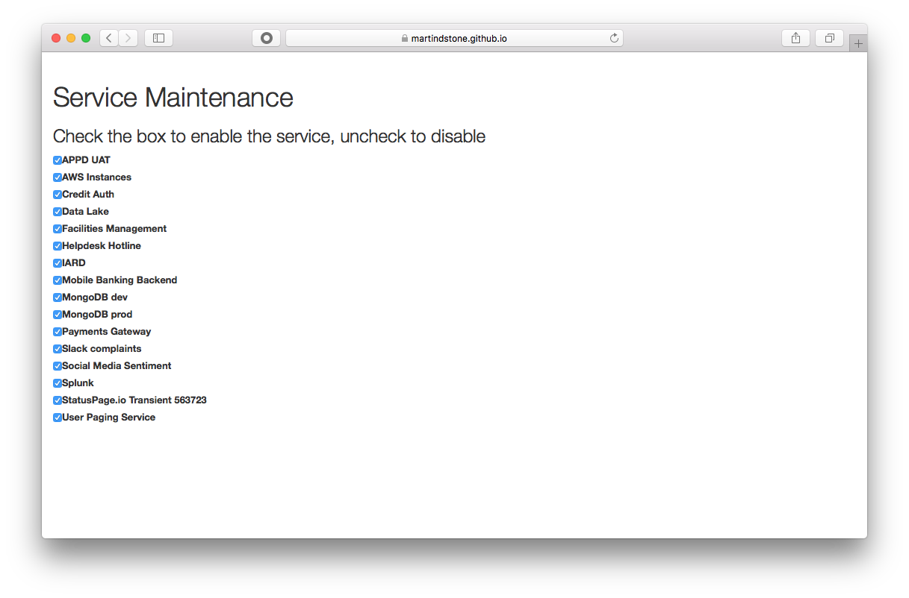

# PDmaintenance
PagerDuty Service Maintenance



This is a simple tool to allow users to quickly disable and enable many services at once. Check the box to enable the service, uncheck it to disable. Changes are instant, so be careful!

## Instructions for use:

Construct a URL like so:

```
https://pagerduty.github.io/addons/PDmaintenance/index.html?token=<TOKEN>
```

Replace <TOKEN> with a full access v2 API token. That's it! You should now see the a list of services with a checkbox next to each one. You can use this tool standalone in your browser, or add it to your Add-Ons menu in PagerDuty.
