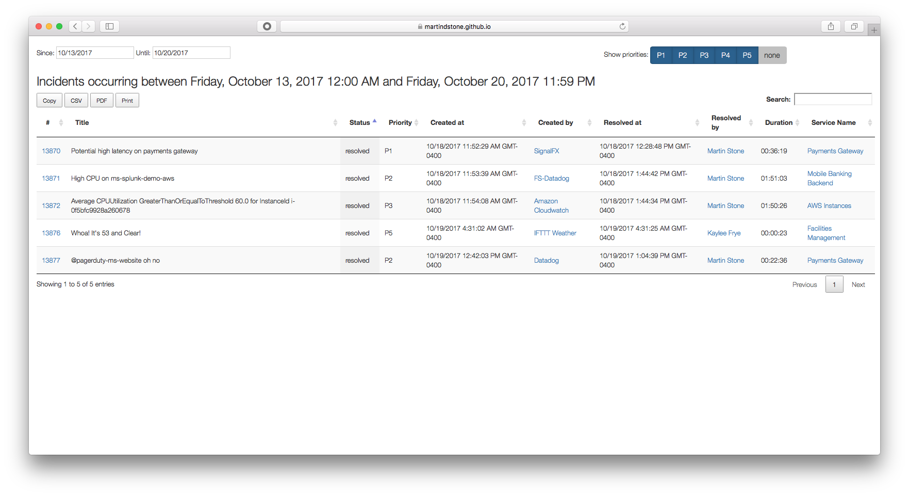

# PDpriority
PagerDuty Priority Report



This is a simple tool that reports on incidents in a time range filtered by assigned priority. You can select which priorities are to be included in the report by clicking on each of the different priority levels.

## Instructions for use:

Construct a URL like so:

```
https://pagerduty.github.io/addons/PDprioritye/index.html?token=<TOKEN>
```

Replace <TOKEN> with a read-only v2 API token. That's it! You should now be able to load the page and see the report generated. You can use this tool standalone in your browser, or add it to your Add-Ons menu in PagerDuty.
