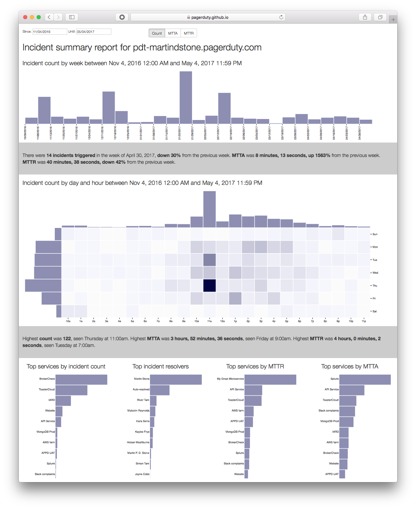

# PDvis

This is a standalone tool, also suitable for use as a PagerDuty add-on, that aims to show some useful visualizations of PagerDuty activity over time.

## How to use

Go to https://pagerduty.github.io/addons/PDvis/index.html and click Sign In.
